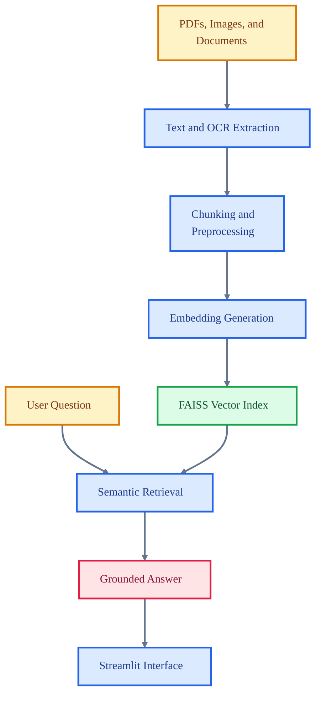

# Docuquery

<p align="center">

  
  
  
  
  
</p>

<p align="center">
  <strong>A retrieval-augmented document question-answering system for extracting, indexing, and querying unstructured files.</strong>
</p>

Docuquery turns documents into an interactive knowledge base. It extracts text from PDFs and images, builds vector indexes, and presents a Streamlit interface where users can ask grounded questions over their own documents.

## Core Capabilities

- Extracts text from PDFs, images, and document inputs.
- Builds embedding-backed indexes for semantic retrieval.
- Answers user questions with context from indexed documents.
- Includes model download and extraction utilities for local setup.

## Technical Architecture

The application combines extraction utilities, embedding/indexing dependencies, and a Streamlit app. FAISS provides vector search while document loaders and OCR-related packages broaden input coverage.

## Architecture Diagram



## Technology Stack

- Streamlit for the interactive application.
- FAISS and sentence-transformer style embeddings for retrieval.
- LangChain components for retrieval workflows.
- PyMuPDF, pytesseract, pdf2image, and OpenCV for document extraction.
- Hugging Face tooling for local model assets.

## Repository Structure

- `app.py` - Streamlit application entry point.
- `extractor.py` - Document extraction utilities.
- `download_models.py` - Model asset setup helper.
- `requirements.txt` - Python dependencies.
- `image.png` - Project visual asset.
- `new.png` - Project visual asset.

## Getting Started

```bash
python -m venv .venv
source .venv/bin/activate
pip install -r requirements.txt
```

```bash
streamlit run app.py
```

## Professional Context

This project demonstrates retrieval-augmented application design, document processing, OCR workflows, and local knowledge-base interaction.
